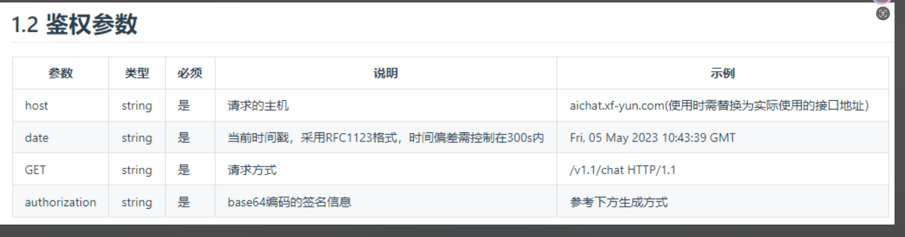
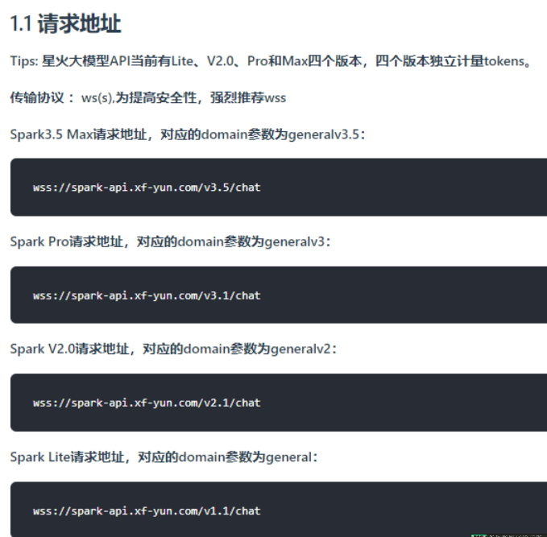
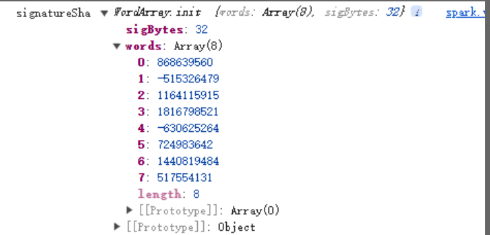

# 需要用到的依赖

需要安装依赖： url base-64 @escook/request-miniprogram utf8

该模块具有用于 URL 解析和解析的实用程序，旨在与node.js核心 [url](http://nodejs.org/api/url.html) 模块具有功能奇偶校验。

安装的命令： npm i url

base64 是一个强大的 base64 编码器/解码器，与用 JavaScript 编写的 [atob（） 和 btoa（）](https://html.spec.whatwg.org/multipage/webappapis.html#atob) 完全兼容。它使用的 base64 编码和解码算法完全符合 [RFC 4648](https://tools.ietf.org/html/rfc4648#section-4) 标准。

npm i base-64

主要是配置请请求的 请求拦截器 请求之后做啥之类的

[@escook/request-miniprogram - npm (npmjs.com)](https://www.npmjs.com/package/@escook/request-miniprogram) 链接

npm i @escook/request-miniprogram

utf8.js 是一个经过充分测试的 UTF-8 编码器/解码器，用 JavaScript 编写。与许多其他 JavaScript 解决方案不同，它被设计为一个正确的 UTF-8 编码器/解码器：它可以根据[编码标准](https://encoding.spec.whatwg.org/#utf-8)对任何标量 Unicode 码位值进行编码/解码。

npm i utf8

核心就是要和星火模型的服务器进行连接 连接需要一个url 这个url 需要鉴权 因为他要判断你是不是他的用户

利用应用中提供的appid，APIKey， APISecret进行鉴权，生成最终请求的鉴权url

链接在这里

[WebSocket协议通用鉴权URL生成说明 | 讯飞开放平台文档中心](https://www.xfyun.cn/doc/spark/general_url_authentication.html#_1-%E9%89%B4%E6%9D%83%E8%AF%B4%E6%98%8E)



那么需要凑齐这个几个参数 get 是默认的 可以不用管他 那么就是需要获取 host 和date 和 authorization 的参数

其实就在他提供的url 屁股后面 加上这几个参数 用到官网需要的处理的方式

前缀的url 是 就是在下面这几个链接当中挑选一个出来 咱们现在是3.5版本的



date 参数直接使用 var date = new Date().toGMTString(); 进行操作即可

1.2.2 authorization参数生成规则.

利用上方的date动态拼接生成字符串tmp

```js
// 开始生成规则authorization 生成他之前 要动态拼接这种结构
// """上方拼接生成的tmp字符串如下
// host: spark-api.xf-yun.com
// date: Fri, 05 May 2023 10:43:39 GMT
// GET /v1.1/chat HTTP/1.1
// """
var tmp = `host: ${host}\ndate: ${date}\nGET ${httpUrlPath} HTTP/1.1`;
```

利用hmac-sha256算法结合APISecret对上一步的tmp签名，获得签名后的摘要tmp_sha。

记得优先进进来 结果就是这样

```js
var tmp_sha = CryptoJS.HmacSHA256(tmp,this.APISecret)
```



将上方的tmp_sha进行base64编码生成signature

```js
var signature = CryptoJS.enc.Base64.stringify(tmp_sha);
结果：// 
signature kKh/tlCt0ozFv0mXl1IXyrqhx8OAl+mw7f39rgDpwzg=
```

// 利用上面生成的signature，拼接下方的字符串生成authorization_origin

```js
var authorization_origin =
`api_key="${this.APIKey}", algorithm="hmac-sha256", headers="host date request-line", signature="${signature}"`;
```

处理之后需要来通过url 连接星火大模型

```js
// 和他们服务器进行联链接 


this.socketTask = uni.connectSocket({ 
 //url: encodeURI(encodeURI(myUrl).replace(/\+/g, '%2B')), 
 url: url, 
 method: 'GET', 
 success: res => { 
        console.log(res, "ws成功连接...", url) 
        this.wsLiveFlag = true; 
 } 
}) 

realThis.socketTask.onError((res) => { 
    console.log("连接发生错误，请检查appid是否填写", res) 
}) 
```

需要的参数

```js
{
        "header": {
            "app_id": "12345",
            "uid": "12345"
        },
        "parameter": {
            "chat": {
                "domain": "generalv3.5",
                "temperature": 0.5,
                "max_tokens": 1024, 
            }
        },
        "payload": {
            "message": {
                # 如果想获取结合上下文的回答，需要开发者每次将历史问答信息一起传给服务端，如下示例
                # 注意：text里面的所有content内容加一起的tokens需要控制在8192以内，开发者如有较长对话需求，需要适当裁剪历史信息
                "text": [
                    {"role":"system","content":"你现在扮演李白，你豪情万丈，狂放不羁；接下来请用李白的口吻和用户对话。"} #设置对话背景或者模型角色
                    {"role": "user", "content": "你是谁"} # 用户的历史问题
                    {"role": "assistant", "content": "....."}  # AI的历史回答结果
                    # ....... 省略的历史对话
                    {"role": "user", "content": "你会做什么"}  # 最新的一条问题，如无需上下文，可只传最新一条问题
                ]
        }
    }
}
```

```js
realThis.socketTask.onOpen((res) => { 

 // 打开时之后   
 // 按照他需要的格式发过去 
 // f9de036b 

 this.historyTextList.push({ 
        "role": "user", 
        "content": this.TEXT 
 }) 
    console.info("wss的onOpen成功执行...", res) 
 // 第一帧.......................................... 
    console.log('open成功...') 
 let params = { 
        "header": { 
            "app_id": this.APPID, 
            "uid": "aef9f963-7" 
        }, 
        "parameter": { 
            "chat": { 
                "domain": this.modelDomain, 
                "temperature": 0.5, 
                "max_tokens": 1024 
            } 
        }, 
        "payload": { 
            "message": { 
                "text": this.historyTextList
            } 
        } 
 }; 

 this.sparkResult = this.sparkResult + "\r\n我：" + this.TEXT + "\r\n" 
 this.sparkResult = this.sparkResult + "大模型：" 
    console.log("发送第一帧...", params) 
    realThis.socketTask.send({ // 发送消息，，都用uni的官方版本 
        data: JSON.stringify(params), 
        success() { 
            console.log('第一帧发送成功') 
        } 
 }); 

})
```
