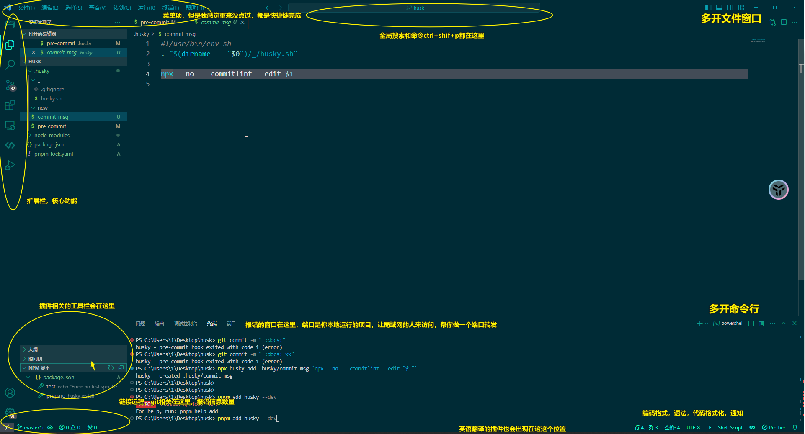
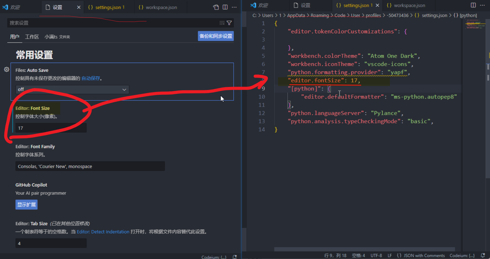
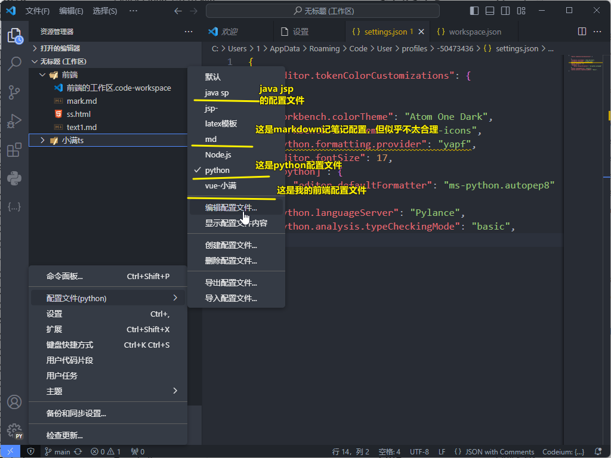
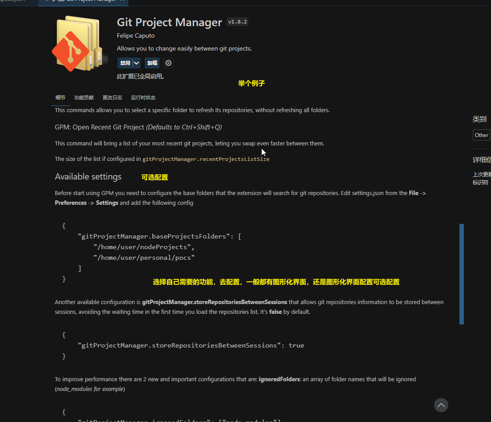
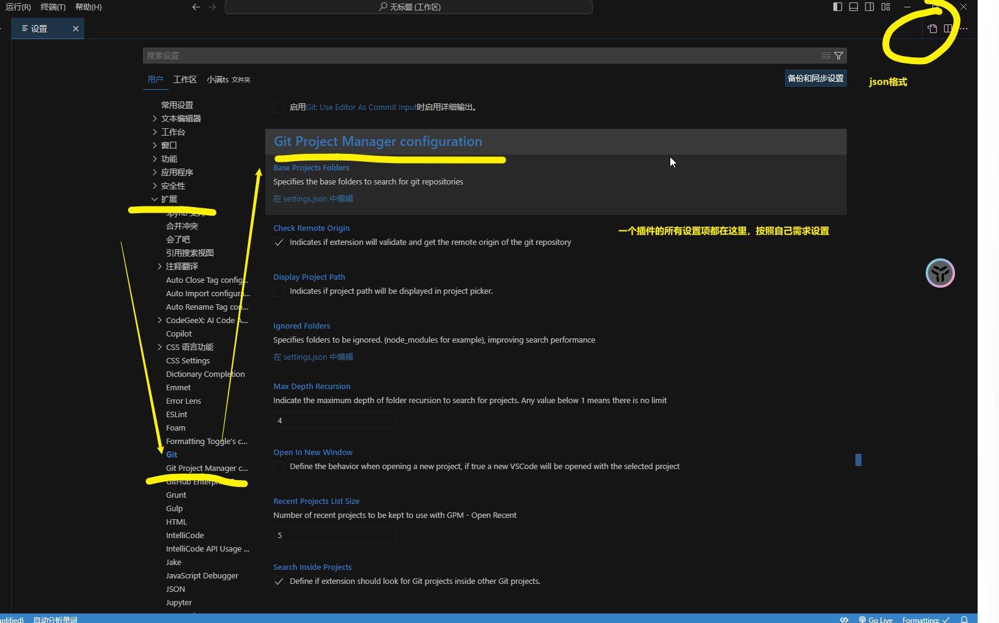
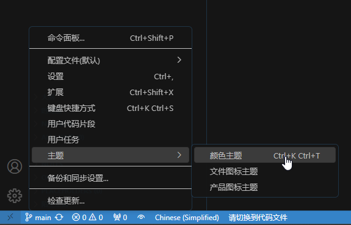

# vscode需要了解啥

[TOC]

author: 创新实验室
date: 2023-11-12
github仓库: https://github.com/SCUJJ-OSIG/knowledge_base
Description: vscode

---

> > > > > > > main

1. vscode插件是他的核心功能
2. 设置，
3. 工作区
4. 配置文件界面
5. 快捷键技巧
6. 命令面板和全局搜索
7. 主题设置

## 2.设置

# vscode需要了解啥

[TOC]

## 1、面板样子

## 2.设置

> > > > > > > main

vscode设置有两个界面，一个图形化操作界面，一个是json格式的设置界面。它们俩是一样的，只是json格式可以copy，复制到多台电脑一键设置，不可能一千台电脑都用图像化界面点、点、点把！ 可以发现国产Hbuilder对标vscode的设置界面也有json格式 

关于设置，每一个配置文件对应一个设置文件，你有n个配置文件，就对对应n个设置。

## 3.工作区

**[vscode 插件 projectManager 使用](https://blog.csdn.net/weixin_43045869/article/details/128308267)**

## 4. 配置文件存在的意义

当我们用vscode开发，java，前端，python时，这些不同的语言对应不同的插件，当一个文件里有.py文件和.html文件可以让vscode的占用内存达到1G，导致打开文件卡顿变慢。但配置文件可以单独为java文件和python文件设置一份单独的配置文件，**即**运行python，只加载python的插件，运行前端只运行前端的插件。

## 插件

vscode很多插件需要配置，并不是所有插件点击即用，还需要配置设置

主要是配置的插件比较麻烦，翻译下，自己打开对应的配置文件的json格式，进行配置。

## 5.快捷键

`<kbd>`ctrl`</kbd>` +`<kbd>`+/-`</kbd>`  放大/缩小界面代码

`<kbd>`ctrl`</kbd>` +`<kbd>`b`</kbd>`左侧的扩展栏

`<kbd>`ctrl`</kbd>` +`<kbd>`ENTER`</kbd>`向下跳行

`<kbd>`shift`</kbd>` +`<kbd>`alt`</kbd>`+`<kbd>`A`</kbd>` 切换代码块注释

`<kbd>`ctrl`</kbd>` +`<kbd>`/`</kbd>` 切换代码注释

`<kbd>`ctrl`</kbd>` +`<kbd>`j`</kbd>` 终端

`<kbd>`ctrl`</kbd>` +`<kbd>`shif`</kbd>`+`<kbd>`p`</kbd>` 命令面板

`<kbd>`ctrl`</kbd>` +`<kbd>`p`</kbd>` 全局搜索

`<kbd>`ctrl`</kbd>` +`<kbd>`f`</kbd>` 单文件搜索

## 6.命令面板

命令面板是很重要的功能，很多插件的命令都在这里，要修改设置，也可以在这里。这个靠个人使用领悟，说不明白

## 7.主题设置

在插件商店下载后，在这里激活就行

### 8 .用户片段

[VSCode配置markdown代码片段-CSDN博客](https://blog.csdn.net/eaglejava2015/article/details/133720337)
