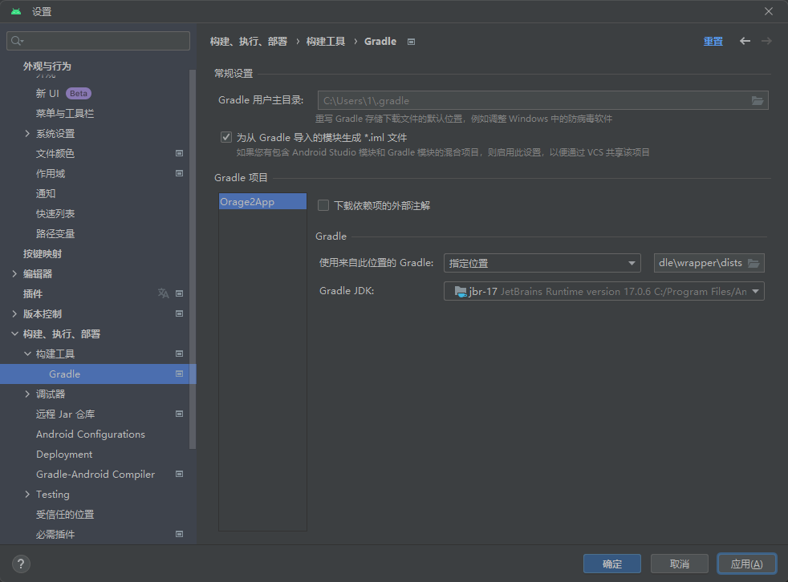
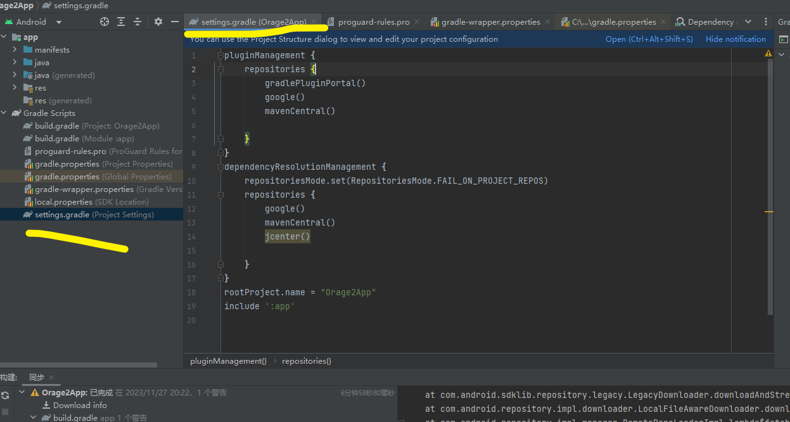

# andriod开发，下载gradle级，极慢处理办法

## 下载到本地

在22版的andriod中都是，打开一个项目就直接下载这个greadle，就算本地有都要下载，我在项目构建工具里，指定了本地的gradle也是没有办法阻止下载。



## 项目文件配置源

然后项目文件的setting.gradle设置一些阿里源也是没用。



## 实践最好的方法

最后找到了一个方法，新建init.gradle，写入阿里代理，下载飞速

[gradle镜像配置：使用阿里云仓库服务的代理仓库地址代替jcenter()、mavenCentral()及google()](https://blog.csdn.net/a772304419/article/details/114437343)

、

就是按照目录，新建一个文件夹和文件


在写入文件内容

```bash
buildscript {
    repositories {
        maven{ url 'https://maven.aliyun.com/repository/public'}
        maven { url 'https://maven.aliyun.com/repositories/jcenter' }
        maven { url 'https://maven.aliyun.com/repositories/google' }
        maven { url 'https://maven.aliyun.com/repository/central' }
    }
}

allprojects {
    repositories {
        maven{ url 'https://maven.aliyun.com/repository/public'}
        maven { url 'https://maven.aliyun.com/repositories/jcenter' }
        maven { url 'https://maven.aliyun.com/repositories/google' }
        maven { url 'https://maven.aliyun.com/repository/central' }
        maven { url "https://jitpack.io" }
    }
}
```
