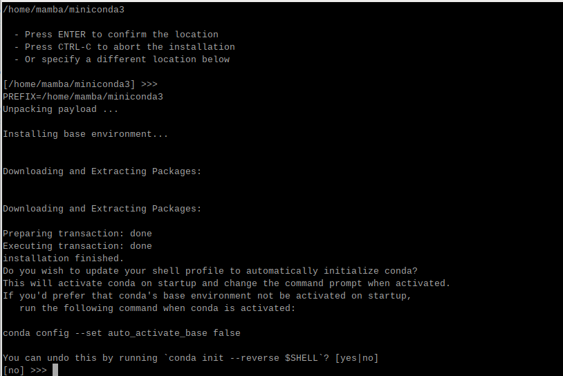
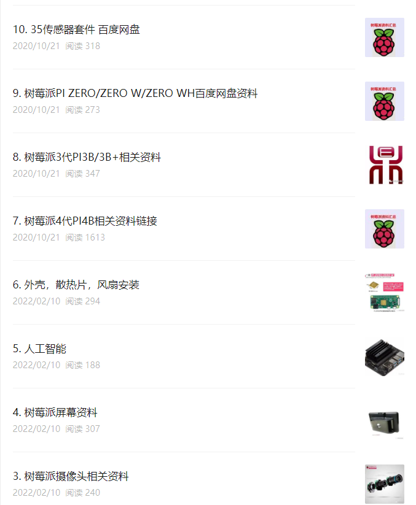
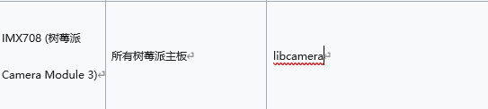
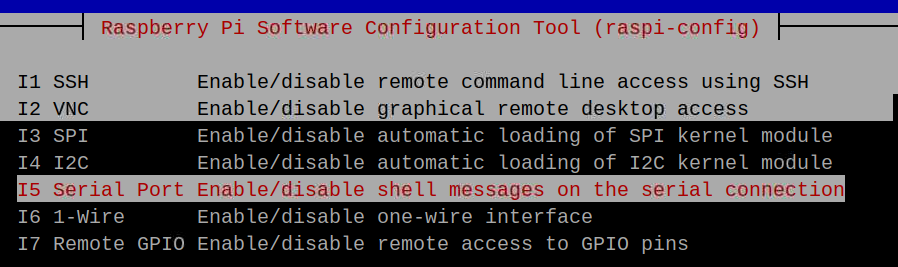
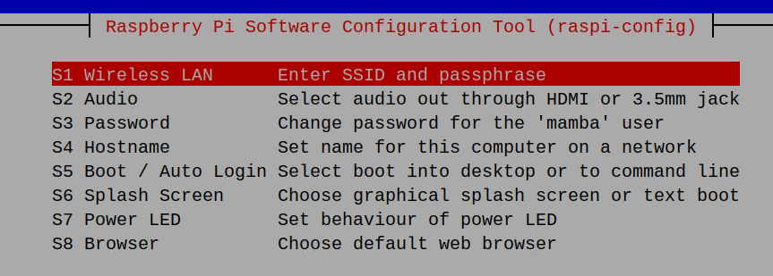
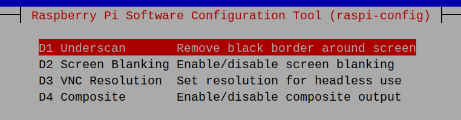
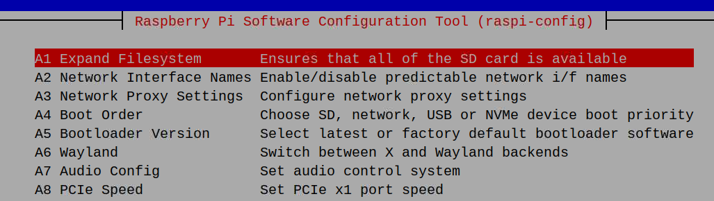

raspi-config

interface  > vnc  打开

```
sudo nano  /etc/apt/sources.list
```

镜像：

```
https://mirrors.tuna.tsinghua.edu.cn/help/debian/  去这个官网选择对应的配置


sudo apt-get update
```

uname -a

python

3.11

bash  Miniconda3-latest-linux-aarch64.sh

[/home/mamba/miniconda3] >>>
PREFIX=/home/mamba/miniconda3
Unpacking payload ...

[Paste](https://file+.vscode-resource.vscode-cdn.net/c%3A/Users/1/Documents/%E7%9F%A5%E8%AF%86%E5%BA%93/linux/s%E6%A0%91%E8%8E%93%E6%B4%BE/# "#")

下载好后需要重启树莓派

yes

cd  yolo

# conda还源

```text
conda config --add channels https://mirrors.tuna.tsinghua.edu.cn/anaconda/pkgs/free/ 
conda config --add channels https://mirrors.tuna.tsinghua.edu.cn/anaconda/pkgs/main/ 
conda config --set show_channel_urls yes

```text
pip config set global.index-url https://pypi.tuna.tsinghua.edu.cn/simple
```

```text
conda -v
conda create --name yolov5List  python=3.11
conda activate yolov5Lite

pip3 install   -r    /home/mamba/pythonenv/Lite/requirements.txt
```

pip install mpmath

pip3 install sympy

环境安好后，导入已有的模型权重

## l另外的优化

https://blog.csdn.net/black_sneak/article/details/131374492

https://blog.csdn.net/weixin_45829462/article/details/119787840#t1

# 树莓派新建用户

su useradd -m  -s /bin/bash  xxx

设置密码

passwd xxx


循环开机引导


断电重启

#### 切换到Root用户

```
sudo -i
```

#### 创建新用户

```bash
useradd -m  mamba（新用户名）
1
```

#### 设置密码

```bash
passwd 新用户名
1
```

#### 将新用户加入sudo用户组

```
adduser newname sudo
```

#### 查看用户所属组

```bash
id 新用户名
```

#### 修改[shell](https://so.csdn.net/so/search?q=shell&spm=1001.2101.3001.7020)为/bin/bash

新用户默认为/bin/sh，可以通过echo $SHELL查询，默认不能使用TAB键、上下键，[命令行](https://so.csdn.net/so/search?q=%E5%91%BD%E4%BB%A4%E8%A1%8C&spm=1001.2101.3001.7020)不显示当前路径

```bash
usermod -s /bin/bash arslantech
```

## 给予用户sudo权限

```
visudo  //权限配置文件
```

ALL=(ALL) ALL

# 调分辨率

树莓派vcn显示cannot currently show the desktop

```
sudo raspi-config  》》》display option  >>> vcn  resolution
```

**[产品资料链接](https://mp.weixin.qq.com/mp/appmsgalbum?__biz=MzIwMzExOTU3Mw==&action=getalbum&album_id=3221157057165508608&scene=173&subscene=7&sessionid=undefined&enterid=0&from_msgid=2652452947&from_itemidx=1&count=3&nolastread=1#wechat_redirect)**



#Q 问题

Failed to allocate buffers

回答：

```bash
otg_mode=1
dtoverlay=vc4-kms-v3d,cma-512
dtoverlay=arducam_64mp
dtoverlay=arducam_64mp, cam0
gpu_mem=64
arm_boost=1
```

指令是用于配置树莓派（Raspberry Pi）的启动配置，主要涉及USB OTG模式、图形加速、摄像头支持以及内存分配等方面。下面是对每一条指令的解释：

1. `otg_mode=1`:
   此指令设置USB控制器工作在OTG（On-The-Go）模式。在树莓派上，这通常意味着USB接口可以作为主机使用，即树莓派可以连接USB设备，比如闪存驱动器、键盘或鼠标。设置为1启用此功能，使得树莓派在没有外接电源的情况下也能通过USB OTG给其他设备供电（如果设备支持）。
2. `dtoverlay=vc4-kms-v3d`:
   启用VideoCore IV（VC4）GPU的Kernel Mode Setting（KMS）和V3D（Video Core Next 3D Accelerator）硬件加速。这意味着树莓派的图形系统将使用现代Linux内核的图形驱动模型，并允许利用GPU进行3D加速，这对于图形密集型应用（如游戏、图形渲染或复杂的用户界面）特别有用。
3. `cma-512`:
   这部分指令通常与上面的 `dtoverlay=vc4-kms-v3d`一起使用，代表“Contiguous Memory Allocator”，分配512MB连续内存给GPU使用。CMA有助于确保GPU可以获取到大片连续的内存空间，这对于图形处理和硬件加速功能至关重要。
4. `dtoverlay=arducam_64mp`:
   加载Arducam的6400万像素摄像头overlay。这意味着配置树莓派以支持特定型号的Arducam高分辨率摄像头模块。此overlay包含了必要的驱动和配置，使摄像头能够正确地与树莓派的硬件和软件接口。
5. `dtoverlay=arducam_64mp, cam0`:
   与上面的指令相似，但额外指定了摄像头为系统中的“cam0”。这帮助系统识别和配置该摄像头为默认或第一个摄像头设备，便于软件调用。
6. `gpu_mem=64`:
   设置分配给GPU的内存为64MB。这决定了树莓派的GPU可以使用的内存总量，影响图形处理能力。根据应用需求，这个值可以调整以平衡CPU和GPU之间的内存使用。
7. `arm_boost=1`:
   启用ARM CPU的动态电压和频率调整（DVFS）中的“boost”模式。这通常意味着在需要时，CPU核心可以短时间内超频运行，以提高处理性能。这对于要求瞬时高性能的任务特别有帮助，但也可能增加功耗和发热。

这些配置项共同作用，优化了树莓派对于高分辨率摄像头的支持、图形加速能力、内存管理和CPU性能，以满足特定项目或应用的需求。

```shell
//操作系统发行版信息的文件内容

cat /etc/os-release
```

```bash
PRETTY_NAME="Debian GNU/Linux 12 (bookworm)"
NAME="Debian GNU/Linux"
VERSION_ID="12"
VERSION="12 (bookworm)"
VERSION_CODENAME=bookworm
ID=debian
HOME_URL="https://www.debian.org/"
SUPPORT_URL="https://www.debian.org/support"
BUG_REPORT_URL="https://bugs.debian.org/"
```

输出来自 `/etc/os-release`文件，提供了关于所运行的Debian操作系统的重要信息。下面是各项内容的详细解释：

- `PRETTY_NAME="Debian GNU/Linux 12 (bookworm)"`: 这是一个用户友好的操作系统全称，表明这是一个Debian GNU/Linux系统，版本为12，代号为"bookworm"。
- `NAME="Debian GNU/Linux"`: 系统的基本名称，这里是"Debian GNU/Linux"，强调了其基于GNU项目和Linux内核。
- `VERSION_ID="12"`: 系统版本的简洁数字标识，对应于Debian的版本号12。
- `VERSION="12 (bookworm)"`: 系统版本的详细描述，同样指出版本号12和代号"bookworm"。
- `VERSION_CODENAME=bookworm`: 版本代号，即内部用于识别该版本的代码名，这里也是"bookworm"。
- `ID=debian`: 系统的ID，用于软件包管理和脚本中辨识操作系统，这里是"debian"。
- `HOME_URL="https://www.debian.org/"`: 操作系统的官方主页链接，用户可以访问此网址获取更多信息和支持。
- `SUPPORT_URL="https://www.debian.org/support"`: Debian提供的官方支持页面链接，用户遇到问题时可以在这里寻找帮助。
- `BUG_REPORT_URL="https://bugs.debian.org/"`: Debian的错误报告系统链接，鼓励用户在此报告发现的系统错误或问题，以便开发者修复。

## 查看内存情况

sudo watch -n 0.1 cat /proc/meminfo

//查看硬件配置

nano  /boot/firmware/config.txt

1. `dtoverlay=w1-gpio`:
   这条指令是用来启用1-Wire接口的overlay。1-Wire是一种由Dallas Semiconductor（现属Maxim Integrated）开发的通信协议，允许通过单根数据线与多个设备（如温度传感器DS18B20）通信。这条命令告诉系统在启动时加载w1-gpio overlay，使得树莓派能够通过GPIO引脚支持1-Wire设备的连接和通信。
2. `dtparam=uart0=on`:
   这个指令是用于控制UART0（串行端口0）的状态。在树莓派上，UART0通常是与蓝牙模块共享的。当设置为 `on`时，它指示系统在启动时使能UART0功能，允许通过此端口进行串行通信。这对于连接串行设备，如调试串口、GPS模块、以及其他需要串行通信的外设非常有用。需要注意的是，如果启用UART0，可能需要禁用蓝牙功能，因为它们共用硬件资源。
3. `dtparam=pciex1_gen=3`:
   这条指令看起来是为了配置PCI Express (PCIe) 接口的，但是树莓派（截至我知识更新的时间点）并没有原生的PCIe接口，所以这条指令在标准树莓派配置中并不适用，可能是针对某个特定的定制硬件或者是一个理论上的配置示例。在一般情况下，"pciex1_gen=3" 指令意味着尝试将PCIe x1通道设置为第3代（Gen 3）速度，提供更高的数据传输速率。然而，由于树莓派不直接支持PCIe，这条指令在树莓派的上下文中是没有效果的，除非是针对那些极少数特殊改造或附加板卡的情况。

## 开启相机

```
sudo libcamera-hello -t 0
```

## 相机版本 camera module3

IMX708 (树莓派Camera Module 3)



 获取dmaheap信息

cat   /boot/firmware/config.txt

# 翻译

**开启摄像头接口**

**打开树莓派终端，输入指令进入设置界面  sudo raspi-config**



I1 SSH使用SSH启用/禁用远程命令行访问
I2 VNC启用/禁用图形远程桌面访问
I3 SPI启用/禁用SPI内核模块的自动加载
I4 I2c启用/禁用I2c内核模块的自动加载
I5串行端口启用/禁用串行连接上的外壳消息
I6单线启用/禁用单线接口
I7远程GPIo启用/禁用GPIo引脚的远程访问


您希望启用串行端口硬件吗？



Raspberry Pi软件配置工具（raspi config）
S1无线局域网输入ssID和密码
S2音频通过HDMI或3.5毫米插孔选择音频输出
S3密码更改“曼巴”用户的密码
S4主机名设置网络上此计算机的名称
S5引导/自动登录选择引导到桌面或命令行
S6启动屏幕选择图形启动屏幕或文本引导
S7电源LED设置电源LED的行为S8浏览器选择默认web浏览器



D1屏幕下方删除屏幕周围的黑色边框
D2屏幕消隐启用/禁用屏幕消隐
D3 VNC分辨率设置无头使用的分辨率
D4合成启用/禁用合成输出



A1扩展文件系统确保所有sD卡都可用
A2网络接口名称启用/禁用可预测的网络i/f名称
A3网络代理设置配置网络代理设置
A4引导0优先级选择SD、网络、USB或NVMe设备引导优先级
A5引导加载程序版本选择最新或出厂默认的引导加载程序软件
A6陆地在X和陆地后端之间切换
A7音频配置设置音频控制系统
A8 PCIe SpeedSet PCIe x1端口速度
