# WinGet

在开始之前，先介绍一个win包管理工具，如同node的npm，java的maven，andriod的gradle。

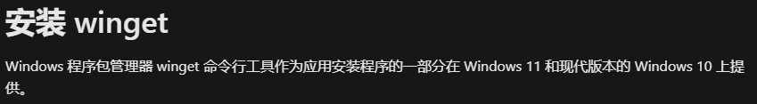

1.换下载源

```shell
winget source list  # 查看下载源：
#二选一
winget source reset #删除现有所有源
winget source remove winget   #移除微软官方源
#
winget source add winget https://mirrors.ustc.edu.cn/winget-source #替换 USTC 镜像：


winget search git  #搜索git的安装包
winget show --id git.git  #显示以id为 git.git的包信息
winget install --id git.git  --rainbow # 安装指定包  --reinbow 安装时的进度条


#其他命令
winget source reset winget  #重置为官方地址：
winget --info # 显示工具的常规信息
```

如果没有代理工具，下载git还是会很慢，所以清华源

**git-2.45.1** 的[下载地址](https://mirrors.tuna.tsinghua.edu.cn/github-release/git-for-windows/git/Git%20for%20Windows%20v2.45.1/Git-2.45.1-64-bit.exe)

```
https://mirrors.tuna.tsinghua.edu.cn/github-release/git-for-windows/git/Git%20for%20Windows%20v2.45.1/Git-2.45.1-64-bit.exe
```

# git 安装 （提供关键信息选择）

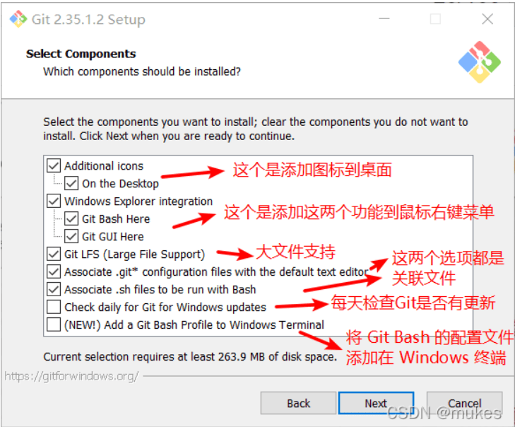

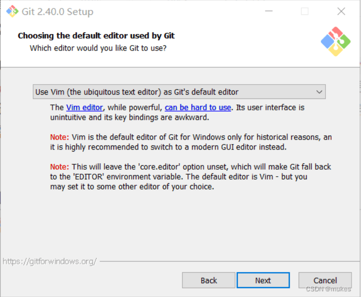

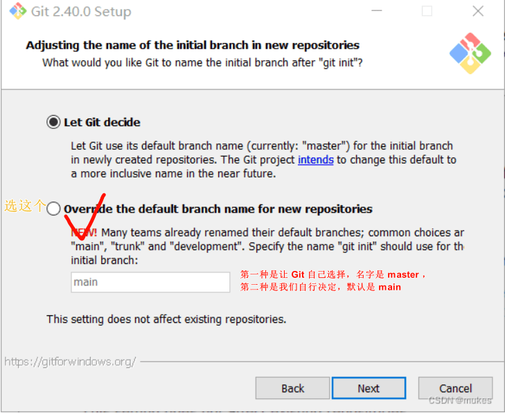

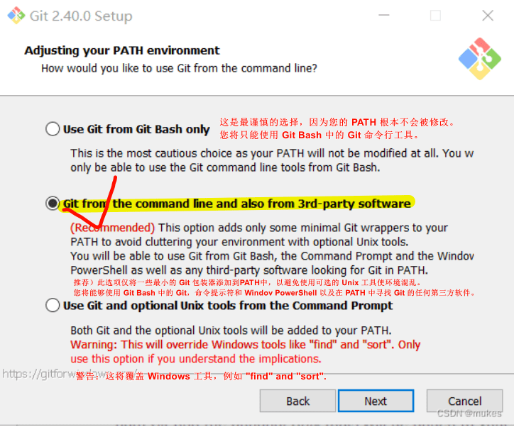

之后一路点击Next

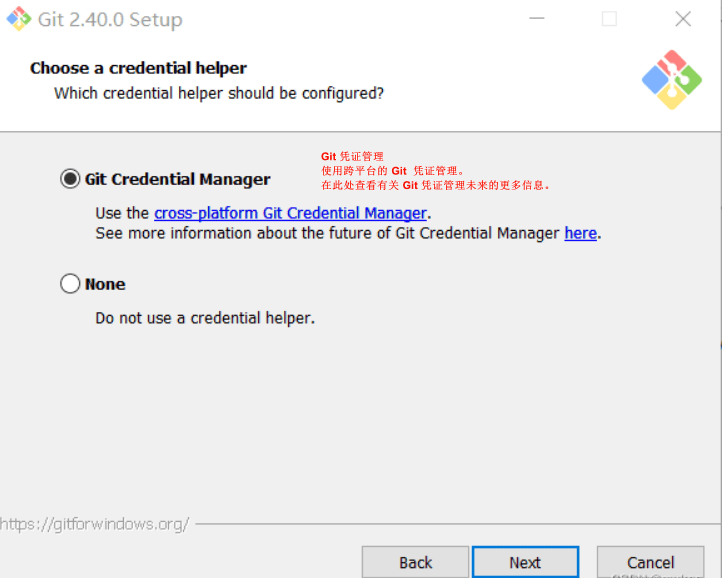

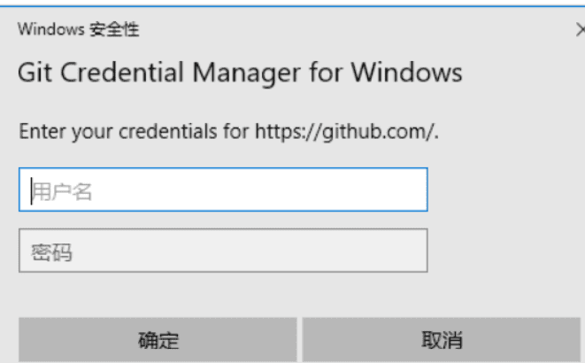

之后一路点击Next。

# git初始化

#### 用户信息

当安装完 Git 应该做的第一件事就是设置你的用户名称与邮件地址。 这样做很重要，因为每一个 Git 的提交都会使用这些信息，并且它会写入到你的每一次提交中，不可更改：

```shell
git config --global user.name "Junk Chen" #“Junk Chen”是你自己设置的名字。
git config --global user.email junkchen@vip.qq.com #junkchen@vip.qq.com是你的邮箱地址
```

# git 交作业

#### 1.常用命令

```shell
git config --list   # 检查配置信息
git init 
git clone https://gitee.com/he-knows/task1.git
git status   #查看文件的
git branch -a  #查看所在目录的所有分支
echo xxx > readme.md   #把xxx写入到readme.md文件
git add READEME.md   #把文件添加到暂存区  .代表当前目录所有东西  
git commit -m " init： 初始化" # 添加到本地仓库，并加上注释

git remote  #查看远程仓库


git push origin master  #把本地仓库推送到远程仓库origin 的master分支
```

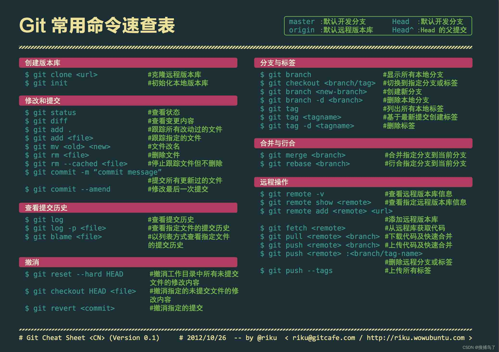

2.在桌面新建文件夹

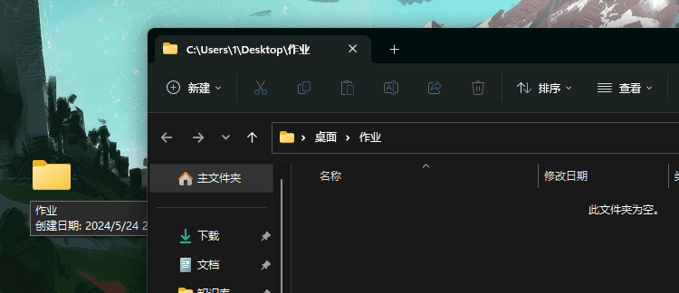

右键，选择>>在终端中打开，或者在地址栏输入cmd

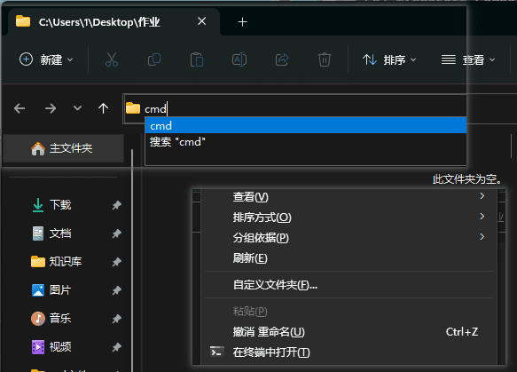

3.cmd中输入

```shell
git clone https://gitee.com/he-knows/task1.git
```

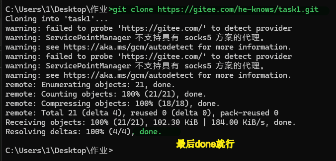

4.进入

```shell
cd task1  # tab键 快速弹出目录 cd t 
```

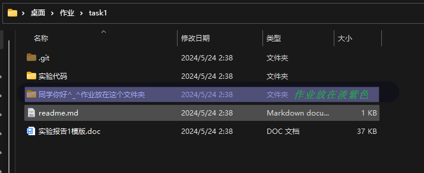

5.放入你的word文档

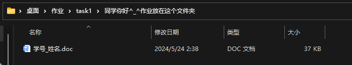

6. shell中输入

```shell
git add .
git status
git conmit -m " 你的姓名 完成作业1"

git push origin master  #推到远程仓库
```

7.成功


# 添加本地ssh秘钥到远程仓库平台

1. **生成了SSH密钥对**,运行以下命令来生成一个RSA密钥对（默认情况下会保存在`~/.ssh/`目录下，`id_rsa`是私钥文件，`id_rsa.pub`是公钥文件）：

```shell
ssh-keygen -t rsa
```

- **-t**: 指定密钥的类型。在这里，`rsa` 表示我们将生成一个RSA类型的密钥对。
- **rsa**: 随 `-t` 之后，指定实际的密钥类型名称。RSA是目前较为常用的一种密钥类型，尽管Ed25519因为其更强的安全性而逐渐变得流行。
2. **查找公钥**:
   SSH公钥通常存储在`.ssh/id_rsa.pub`（如果你使用默认设置和RSA密钥类型）或者相应私钥的`.pub`文件中。你可以用文本编辑器打开这个文件查看公钥，或者使用如下命令打印公钥到终端：

```shell
cat  ~/.ssh/id_rsa.pub
```

3. **添加公钥到GitHub账户**:
   登录到GitHub，点击右上角的头像，选择“Settings” > “SSH and GPG keys” > “New SSH key”。在“Title”框中输入一个便于记忆的标题（例如，“Home Laptop”），在“Key”框中粘贴你的公钥（即你在上一步中复制的内容）。完成后点击“Add SSH key”。

4. 登录到[Gitee](https://gitee.com/)，点击右上角的头像，选择“账号设置” > “安全设置” > “SSH公钥”。在“标题”框中输入一个便于记忆的标题（例如，“xxx的电脑”），在“公钥”框中粘贴你的公钥（即你在上一步中复制的内容）。完成后点击“确定”。

5. **测试连接**:
   可以通过运行以下命令来测试你的电脑是否能成功通过SSH连接到GitHub：

```bash
ssh -T git@github.com
ssh -T git@gitee.com
```

配置正确，你会看到类似于“Hi username! You've successfully authenticated...”的消息

# 一个图形化的Git客户端  [Tortoisegit](https://tortoisegit.org/download/)

自行了解

[TortoiseGit 使用教程 - 啊，那一个人 - 博客园](https://www.cnblogs.com/anayigeren/p/10177027.html)

# Git 高级进阶

1. [git-简明指南  ]([git - the simple guide - no deep shit!](https://rogerdudler.github.io/git-guide/index.zh.html))         [图形化模式，简单易懂]

2. [图解Git   ]([图解Git](http://marklodato.github.io/visual-git-guide/index-zh-cn.html))                [一样是图形化教程]

3. .[Git的奇技淫巧   ](https://github.com/521xueweihan/git-tips)     [GitHub 14.9k stars]
