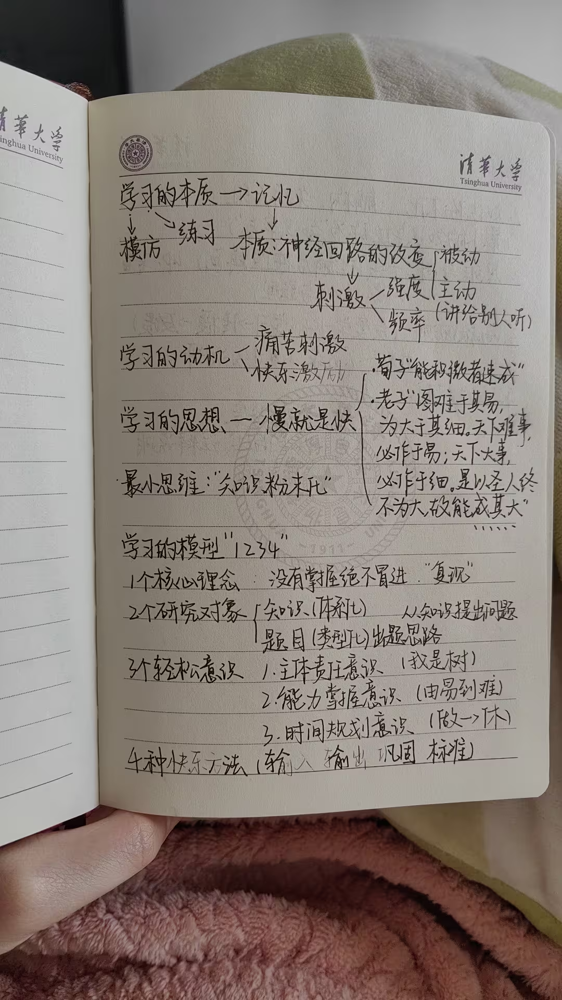
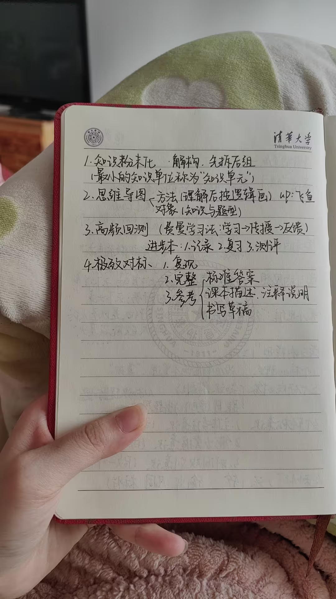
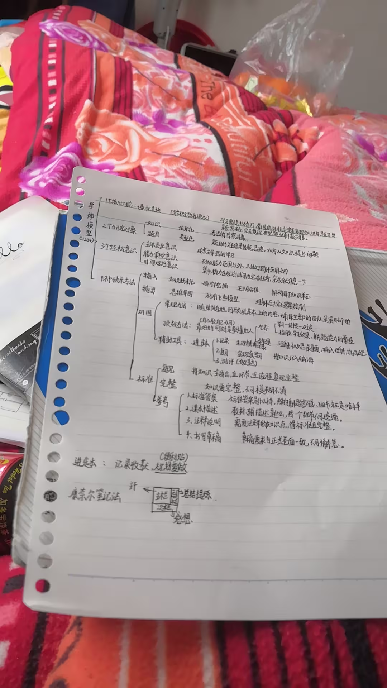

当已经成为习惯之后就不要刻意去想已经完全吸收了，也就是视频提到的慢就是快。提升是一个长期的过程，大家千万不要急

但是不要忘记堆有效学习时长，以前我一直觉得天才是天生的，天赋高，但是后来我发现一般都只存在于最顶流的那一批人，什么北大，清华神童那种，考研主动交的985天才朋友多了，发现，天才最厉害的是能维持较长有效学习时间而不松懈。很多视频博主都告诉你，不要堆时间，更多是强调方法和技巧，当然这也是有原因的，各位如果要是从零开始的话，长时间学习的疲惫感和挫败感很容易导致半途而废，但是当你能掌握有效学习的方法的时候，最好不要忽略增加有效时长，因为这对于绝大部分不是最顶尖的那一批天才的人来讲（过目不忘，数学神童…），都是至关重要的

原理就是一定要形成不会忘记的长时间记忆。高频率回忆，找到知识点的关联，极快的知识运用方式。比如教会他人，练就一秒看出解题思路。就算完成了知识点的掌握。

，其实学习真正的核心就是一个OKR系统，设定目标，重复执行，检验成果。而这张导图里99%的内容不过是用来帮助我们容易地接受需要“死记硬背”的事实，死记硬背和刷题就是终点，也是起点，是每个小学生就会的但是却最终极的方法论

飞鱼逻辑模型

一个数据库，自己给传入的东西打上标签，思维导图，可以详细看到里面的内容，可视化学习路程。

知识世界。

像双链笔记。
