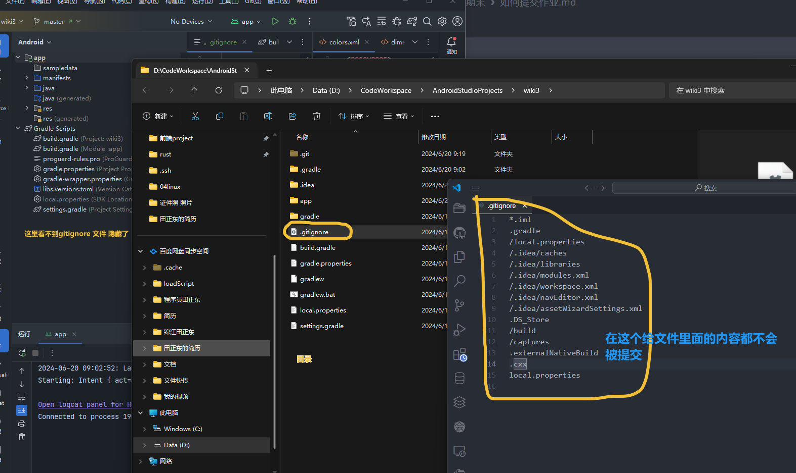
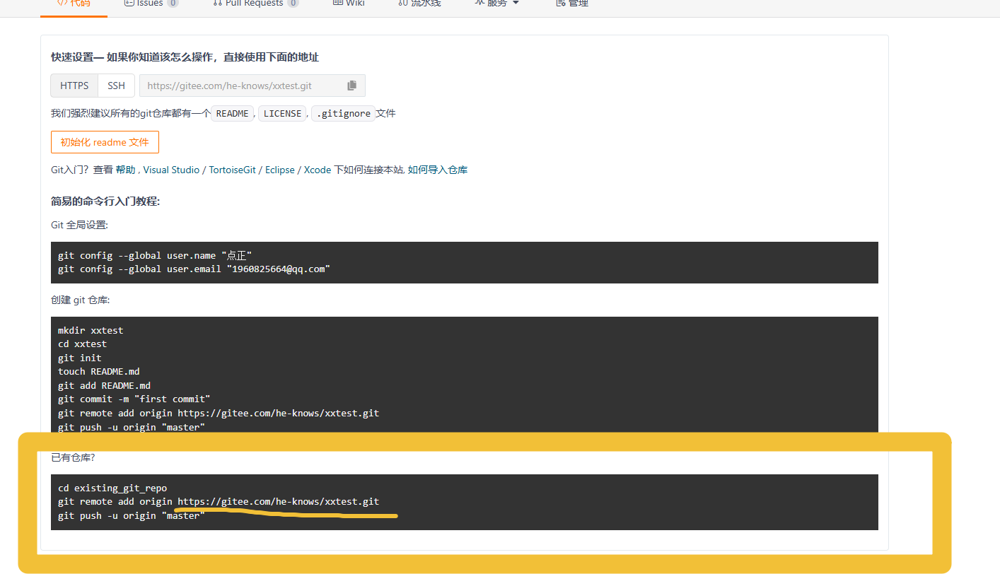
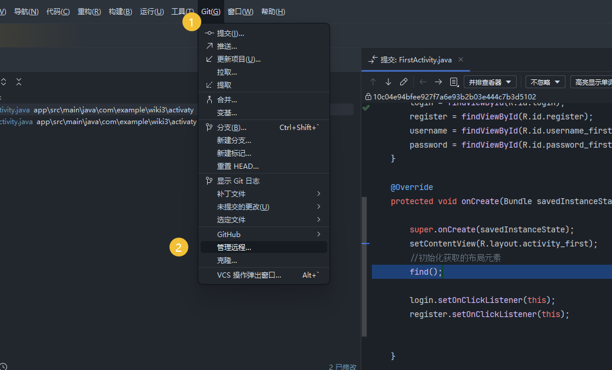
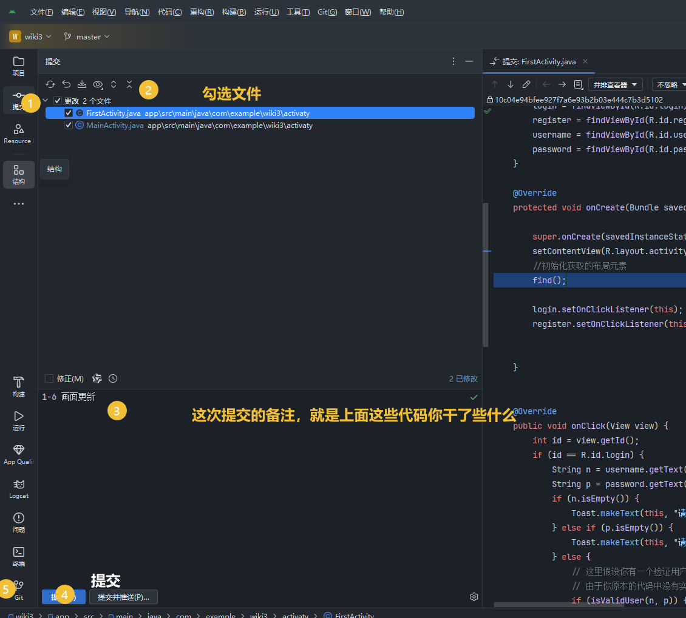
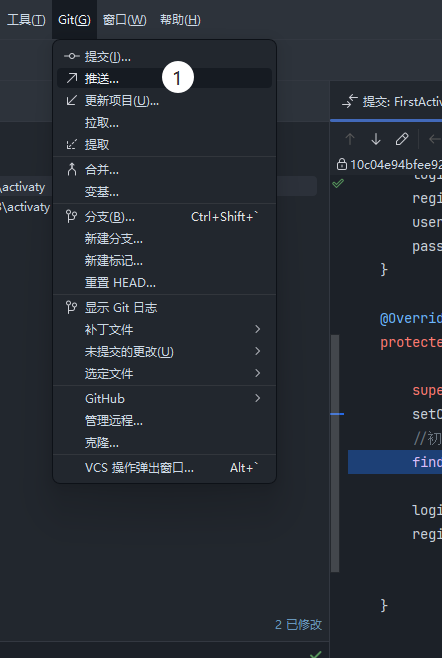
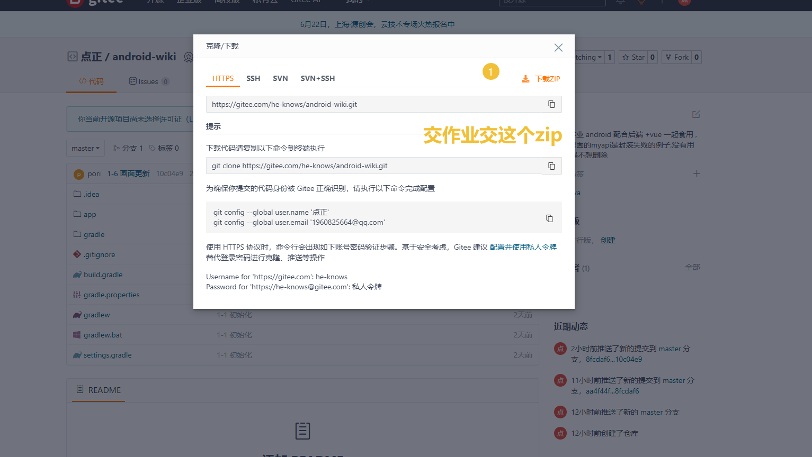
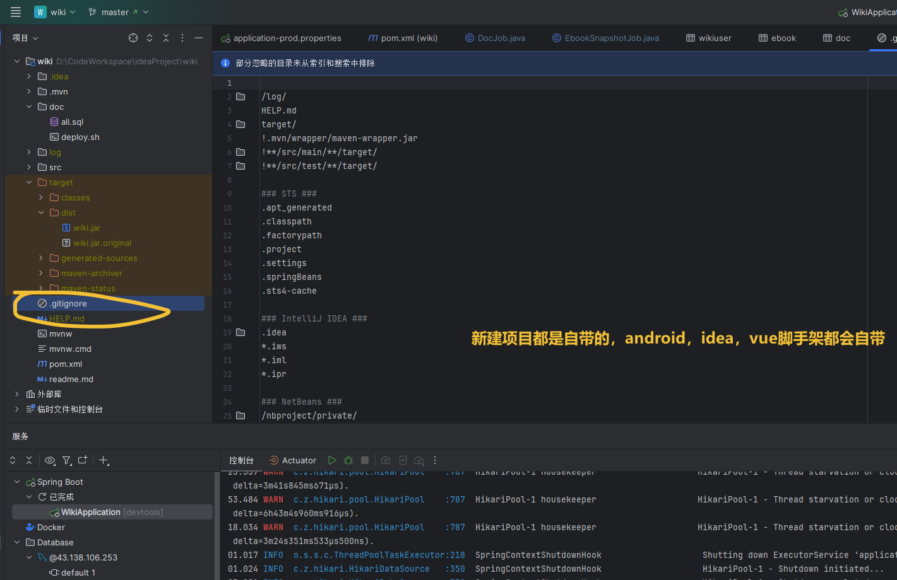
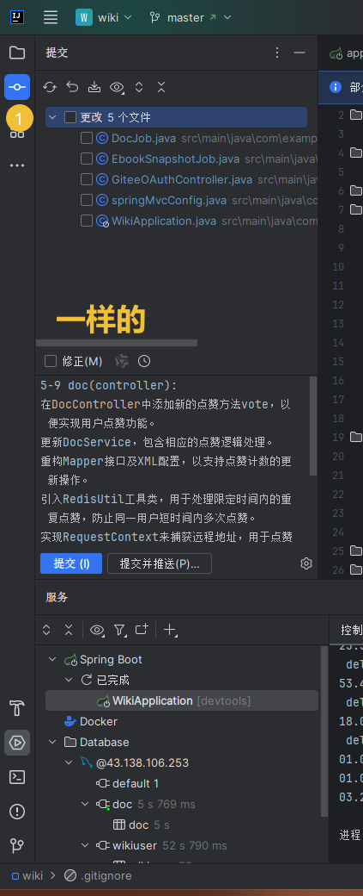
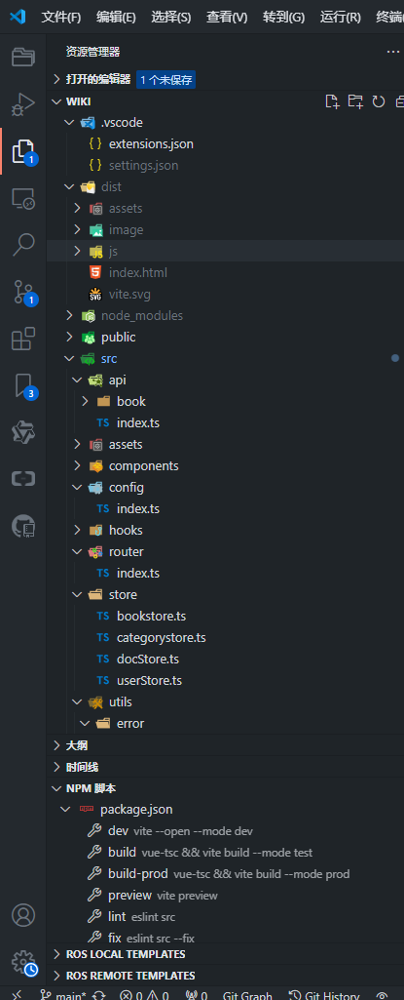
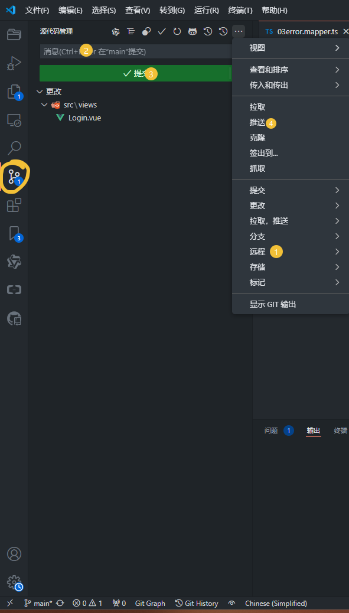

请用git结合github管理代码， 提交git之后，再从官网下载代码提交学委；


```shell

git init 

git add .  #空格

git commit -m " 第一次提交"

git 


```


## 首先最重要的是.gitignore文件

先看看本地是否有着这个文件，有就下一步，没有就百度：




基本步骤都是，在gitee新建仓库，





在idea里面添加远程仓库，





勾选所有文件

勾选点击代码提交，



push远程仓库：






# 后端








# 前端






zip
